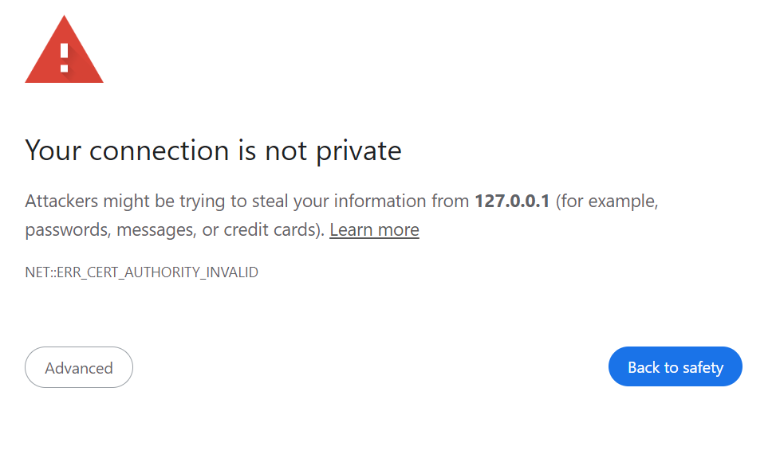

# Network Devices connectivity.
## The circle of life (for a switch)

### Genesis

When grabbing a router or a switch from your [local electronics shop](https://www.google.com/search?q=local+electronics+store) The first thing you want to do is configure it.
You will ~~Probably~~ connect to the console of the device and give it an IP.
After that has been done you will want to deploy the device to the network.

### Off site connectivity

After deploying the physical device you will need to connect to it. 
Of course that physically going to the device to connect via console every time a change is needed is not the ideal option.
In the past we used [Telnet](https://www.wikipedia.org/wiki/Telnet) to control the remote devices.
Just pop the telnet command with the remote IP, enter the username and password and bang! you're in.
```bash
telnet YourDevice.com

Username: YourUsername
Password: YourPassword

YourDevice>
```
Of course, you would need to replace YourDevice.com with the IP/DNS name of the remote device. Same thing to the username and password.
This simple act is great and allows you to connect to your device as if you were standing by it but without needing to physically go to it.

### The PROBLEM with telnet

While this would solve the connectivity issue It opens up a **MASSIVE SECURITY HOLE**.
Everything you do is sent through the network in **clear-text** and anyone can see it.
The way to combat it is to not use telnet, but SSH instead.
it is about the same functionality as telnet, but it encrypts all the traffic to the device.

```bash
ssh YourUsername@YourDevice.com
The authenticity of host 'YourDevice (IP.IP.IP.IP)' can't be established.
ECDSA key fingerprint is SHA256:V0FXIFJlYWxseSwgZ2V0IGEgbGlmZSBtYW4u.
Are you sure you want to continue connecting (yes/no/[fingerprint])?yes

Password: YourPassword

YourDevice>
```

### SSH fingerprint

When you connect to a device via SSH for the first time, you might encounter a message asking if you're sure you want to continue connecting, along with the device's fingerprint.
This fingerprint is a [cryptographic hash](https://www.wikipedia.org/wiki/Cryptographic_hash_function) of the device's public key.
It serves as a unique identifier for the device's SSH key.

The purpose of this fingerprint prompt is to verify the authenticity of the device you're connecting to.
If the fingerprint matches what you expect, it indicates that the device you're connecting to is indeed the one you intended to connect to.
This helps prevent man-in-the-middle attacks, where an attacker tries to intercept your connection and impersonate the device you're trying to reach.

It's crucial to always verify the SSH fingerprint, especially when connecting to a device for the first time, to ensure that you're connecting to the correct device and not falling victim to a potential security breach.

An attacker could steal your password and log in as if it was you. 
It is just like websites, you wouldn't connect to a site that had this warning. 
Especially not put in your password.


## Commander

Commander is a command line interface that allows you to send commands to multiple devices at once.
It is achieved through the same methods of connectivity (ssh and possibly telnet) humans use, not through a fancy API or SNMP.
So, when connecting to a device commander, unless instructed otherwise, will use ssh.

here is an exemple:
```commandline
commander device deploy "show int brife"


```
